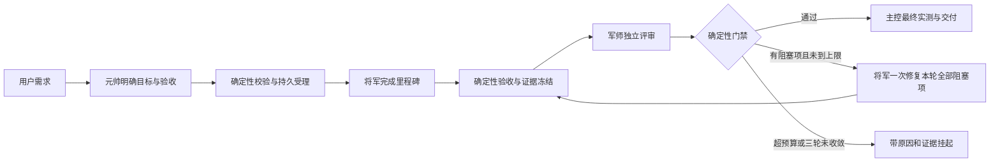

# Superagent 代码、三端部署评审与修复增强方案

评审日期：2026-10-10（Asia/Taipei）。交付性质：只读评审和实施设计；未修改产品代码、配置、运行状态或执行部署。本文件中的改动方案、SLO 和压测指标均为待实施、待验收要求。

## 1. 结论与证据边界

当前方案值得继续沿用：Archon 承担工作流执行，`wetamp/` 承担 Superagent 的计划转换、角色策略与 CLI 适配。已有确定性 DAG、评审轮次上限、执行层只读评审、跨进程资源控制及恢复锁，具备可复用的基础。

但现有证据不足以判定“多个客户端、任意数量进程和命令下持续稳定运行”。任意数量的操作系统进程无法在有限机器上得到资源保证。应把目标实现为：**任意多个客户端可以提交请求；被接受的请求持久可追踪；实际执行量受资源预算限制；超量请求排队或明确拒绝；崩溃、额度耗尽及人工等待都有可观察、可恢复的结果。**

优先顺序是：部署入口与验收事实一致 → 启动/恢复与错误隔离 → 预算及角色策略真正生效 → 上下文和评审往返优化。不能用减少必要评审来掩盖预算缺位，也不需要再造一套通用调度引擎。

| 用户关注点 | 当前判断 | 最重要的差距 |
| --- | --- | --- |
| 稳定性 | 部分机制有效，放量条件未满足 | 启动登记、监督异常隔离、恢复窗口、run 级背压及真实长稳验证 |
| 调用流程 | 基本流程清楚，仍有无效往返 | blocked 未及时分流、重复验收、复审累计材料及未接入的改派 |
| 任务执行 | 已有确定性门禁，但规则事实源尚不完整 | 实际模型身份、变更范围/风险、有效发现台账及 hook 边界 |
| Token 消耗 | 有底层用量事实，尚无完整成本闭环 | 预算只兼容、不执行；effort 固定；report 缺角色用量与失败成本 |

### 1.1 基线

- 工作仓库：`/Users/yong/work/github/superagent_v2`，分支 `wetamp`。
- 开始时 HEAD 为 `247d9b77315f807c58f2e6ac4d7bccfe90c0383f`，已有 17 项 staged/unmerged 状态，包含 `wetamp/docs/PROGRESS.md` 冲突。
- 评审期间另一个会话完成合并，HEAD 变为 `c781f0a432d82e4723a76d37aba7397b16f7fd1f`。本评审未处理该冲突，也未执行 commit。主要源码指纹在合并前后相同；后续结论以 `c781f0a4` 的文件内容为准。
- `wetamp/UPSTREAM:1`：`commit=7009a90a version=0.11.1 branch=dev date=2026-10-09`。
- 范围：`wetamp/` 全部主要执行路径及必要的 Archon CLI、workflow、provider 消费者；本机及统一队列 worker `twin-dev`、`mac-mini` 的 Superagent 接入配置。不是对全部 Archon 文件逐行背书。
- “三端”在本报告指 Claude Code、Codex、OpenCode；“三机”指本机及上述两个 worker。两种维度分别记录，避免把规则同步误当成部署完成。

### 1.2 证据等级

| 等级 | 含义 | 不代表什么 |
| --- | --- | --- |
| 当前代码事实 | 文件及真实调用链能证明该行为 | 不代表生产故障已经发生 |
| 本机实测 | 主控执行的测试或只读状态查询 | fake/stub 测试不代表真实模型成功 |
| 远端实测 | 统一队列返回的命令结果及文件指纹 | 不等于新客户端已实际触发 hooks |
| 条件性风险 | 触发条件和因果链明确，但本轮未注入故障 | 不记为已发生的数据损失 |
| 增强建议 | 未来的设计和验收要求 | 不标成当前已实现能力 |

## 2. 部署现状

### 2.1 三机与三端矩阵

快照窗口主要为 2026-10-10 11:39–11:48。远端使用调度器的 worker 名称归属结果；hostname 仅作为观测值，不额外推断物理机器身份。

| 检查项 | 本机 | `twin-dev` | `mac-mini` |
| --- | --- | --- | --- |
| 新仓库 HEAD | `c781f0a4`，`wetamp` 分支 | `c781f0a4`，detached HEAD | `c781f0a4`，detached HEAD |
| 默认 `superagent` CLI | 新仓库 `wetamp/bin/superagent` | 旧仓库 `bin/superagent` → `lib/v2/cli.cjs` | 同左 |
| 旧 CLI 仓库 HEAD | 本轮未作为运行入口审查 | `8334446e4271964f57c00d77cdaf6ece1c37f926` | 同左 |
| Claude Superagent hooks | 新仓库 `wetamp/hooks/` | 补查时为新仓库，目标存在 | 新仓库，目标存在 |
| Codex Superagent hooks | 新仓库；`features.hooks=true` | 新仓库，目标存在 | 新仓库，目标存在 |
| OpenCode | 有共享规则、supervisor/task-queue 等插件；检查范围未发现 Superagent 专用 hook/plugin | 检查范围未发现专用接入 | 检查范围未发现专用接入 |
| `supervise-tick` plist | 已安装、已加载；间隔 60 秒；查询 last exit=0 | 文件存在，指向新仓库；加载状态未确认 | 指定 plist 文件不存在；不推断其他服务状态 |
| 新 Archon 运行样本 | 9 条：completed 6、failed 1、cancelled 1、running 1 | 可识别新台账样本为空 | 默认 `~/.superagent` 不存在 |
| 旧内核台账样本 | 未纳入本轮新引擎统计 | 默认 v3.db 各任务表为空 | 同左 |

本机版本：Codex `0.162.1`、Claude Code `2.1.296`、OpenCode `1.18.35`、Bun `1.4.2`、Node `v26.8.1`。安装文件和规则存在不等于实际会话已加载；本轮没有重启三端或发起业务 smoke。

三机新仓库的核心内容已一致，代表性 SHA256：

| 文件（相对仓库） | SHA256 |
| --- | --- |
| `wetamp/src/archon.ts` | `0fa225d2ec3a0c68e0b9611783560c019d984e3e8abccf88892ce78063738359` |
| `wetamp/src/cli.ts` | `3c20f0938dcdff9b0e71744b44aa70e5358adb620b5dd21b283d1d7646fdfe95` |
| `wetamp/src/generate.ts` | `ac89f715686a9f7dee0765e758ba465cdb99f45685efd9bb2de3344d390a5b94` |
| `wetamp/tiers.json` | `b6101005b0468fa1329e3360c2f00166cb86542caaf18d713df95567b4047e04` |
| `wetamp/bin/superagent` | `9945b875eda45f8768897d557849538cceebfd4e412c6d489ac4dc81d5506c16` |

三端共享协议区块 SHA256 一致为 `ab665f458917f6e85ee72769eb7efa76d2b264a90eb6d2fd8c34908d4bc57097`。算法为 START 标记起至 END 标记前的原始字节，不包含 END，不做 strip。算法不同的 hash 不应直接判定漂移。

### 2.2 部署判断

**D-01｜高优先级：执行入口的能力与安装模式没有形成一致的用户契约。** 相同命令在本机和远端进入不同内核，Claude/Codex hooks 则已进入新代码。即使新代码哈希相同，调用流程、台账、恢复与参数含义仍可能不同。

这里有一个必要限定：`wetamp/scripts/install.sh:9`、`:25` 及 `wetamp/docs/04-hooks-and-nesting.md:37` 明确存在 `--remote-hooks` 模式，只保证远端 hooks 可用。这可以是合理的 worker 部署。因此，不能仅凭远端未运行新 Archon 或 mini 缺少新定时器，就断言部署故障。本轮未找到“远端同名 CLI 应继续提供旧内核语义”的明确契约。

修复设计：保留本机控制面；安装清单明确标识 `controller` 或 `worker-hooks-only`，列出 release、真实入口、状态目录、协议 hash、运行配置 hash。worker 上的同名命令应明确提示本机能力或经既有统一队列转交控制面，不能静默运行另一套旧语义。若决定每机各自运行控制面，应分别安装、验收和标识台账归属，不能将三份本地数据库假装成一个全局队列。

验收：同一查询在三端新会话中返回可比较的能力清单；controller 的 CLI/hooks/tick 来自同一发布版本；worker 明确报告不具备的操作；在指定模式下做一次完整、可追踪的真实模型任务。此处仅提出步骤，本轮没有执行部署。

**D-02｜能力缺口：OpenCode 没有取得与 Claude/Codex 等价的 Superagent hook 接入证据。** 共享规则能指导调用 CLI，但不能证明前置拦截、派生限制和停止行为等价。验收应覆盖实际事件，而非只比较 `AGENTS.md`。若 OpenCode 定位为手工 CLI 客户端，应明确暴露这一差别，不必为形式对齐另造一套复杂插件。

## 3. 当前代码发现

严重度表示潜在影响；“确定”表示源码行为已成立，不表示生产事故已发生。“条件性”表示需要相应故障窗口或输入。P0 为放量前必须关闭的任务完整性/恢复问题；P1 为用户此次目标需要补齐的功能；P2 为有边界的优化。以下不以数量或分数替代风险判断。

### 3.1 稳定性、恢复与错误传播

| ID | 优先级 / 严重度 | 发现与触发条件 | 证据 |
| --- | --- | --- | --- |
| F-01 | P0 / 高 / 确定窗口 | detached run 启动之后才写 overlay ledger；回执丢失或中途退出会留下 Archon 已执行、Superagent 未登记的任务。再次 run 获得新 ID，不能自动去重。 | `wetamp/src/cli.ts:279`、`:301`；`packages/cli/src/commands/workflow.ts:2472`、`:2597` |
| F-02 | P0 / 高 / 确定 | ledger、asks 直接覆盖；损坏文件及枚举后删除会让批量加载抛异常。加载在逐 run 的 try 之外，一条异常可中断整个 tick/report。 | `wetamp/src/cli.ts:85`、`:93`、`:148`、`:598`、`:600`、`:669` |
| F-03 | P0 / 高 / 条件性 | resume CAS 将状态改回 running 后，到新 execution_owner 写入前，旧死 PID 可能仍可见；第一恢复者获接纳后释放 overlay 锁，第二恢复者可能按旧 owner 再次回拨状态。已有锁/CAS不能仅凭存在就排除此窗口。 | `wetamp/src/archon.ts:233`；`wetamp/src/cli.ts:206`、`:221`；`packages/workflows/src/in-process-engine.ts:64`、`:93`；`packages/workflows/src/executor.ts:2142`、`:2281` |
| F-04 | P1 / 高 / 条件性 | claim/启动窗口中断可留下 pending 或无 owner 的 running。overlay 只自动恢复带本机死 PID 的 running，其余可能长期显示正常运行；PID 复用也会让旧 owner 看似存活。 | `wetamp/src/archon.ts:167`；`wetamp/src/cli.ts:122`、`:605`；`packages/workflows/src/executor.ts:2218`、`:2253` |
| F-05 | P0 / 高 / 条件性 | owner 被 SIGKILL 后，进行中的子进程或已提交的外部效果未必消失；恢复会重跑没有完成记录的节点。已完成节点缓存不等于进行中副作用 exactly-once。 | `wetamp/scripts/selftest.sh:120`、`:133`；`packages/workflows/src/dag-executor.ts:3083`、`:9664`；`packages/workflows/src/dag-resume-snapshot.ts:274` |
| F-06 | P1 / 高 / 确定 | plan 内单命令可配置 180 秒，多命令还可累计更久；生成的 check script 节点未设置对应外层 timeout，Archon script 默认 120 秒可能提前杀掉合法验收。 | `wetamp/schemas/plan.schema.json:260`；`wetamp/src/generate.ts:39`；`wetamp/templates/.archon/scripts/sa-check.ts:53`；`packages/workflows/src/dag-executor.ts:2912`、`:3767`、`:3886` |
| F-07 | P1 / 中 / 确定 | wait 没有校验 finite/positive；`--timeout bad` 得到 NaN，使期限判断失效。同步 get/recover 无独立期限；正常 recover 锁竞争也可被映射为 exit 1 失败。 | `wetamp/src/cli.ts:228`、`:235`、`:249`、`:696`；`wetamp/src/archon.ts:56`、`:287` |
| F-08 | P0 / 高 / 确定能力缺口 | provider 槽位限制已存在，但每个 run 可先启动 worker 再等槽位，没有跨 CLI 的有界 run admission；大量请求仍会消耗进程、worktree 和磁盘。 | `wetamp/src/cli.ts:271`；`wetamp/src/config.ts:126`；`packages/core/src/services/provider-admission.ts:75`、`:107` |
| F-09 | P1 / 中 / 确定 | detached wake 启动后父端日志 FD 未显式关闭，spawn/error/exit 未形成 tick 的可观察结果；wake continuation 可能超过 tick 周期，tick 锁并不覆盖 detached wake 生命周期。 | `wetamp/src/archon.ts:261`；`wetamp/src/cli.ts:597`、`:747`；`packages/core/src/workflows/continuation-host.ts:128` |
| F-10 | P1 / 中 / 确定 | GC 与 tick 的 asks 读改写没有共同锁；GC 共用固定临时文件。另有 signal 成功只依据 run 离开原 paused 状态，可能把并发取消、到期 wake 或别人的 signal 归因为本次批准。 | `wetamp/scripts/gc.sh:38`；`wetamp/src/cli.ts:549`、`:571`、`:587`、`:618`；`wetamp/src/archon.ts:285` |
| F-11 | P0 / 中 / 确定且有现场样本 | fake 自检覆盖正式 `selftest.json`；preflight 只查 ok/at。fake、旧版本、无效日期和配置漂移都不能由现有检查正确区分。本机现场 receipt 为 `fake:true`。 | `wetamp/src/cli.ts:265`；`wetamp/scripts/selftest.sh:8`、`:157` |
| F-12 | P1 / 中 / 条件性 | config 安装直接覆盖；读到暂时空文件时 provider 并发配置可被解析为空 caps。hook 配置固定 `.sa-tmp` 的无锁 RMW、context 计数无锁 RMW也可能丢更新。 | `wetamp/src/config.ts:169`、`:176`；`packages/core/src/config/provider-concurrency.ts:39`、`:58`；`wetamp/src/install-hooks.ts:154`；`wetamp/hooks/context-budget.cjs:66` |

**F-01–F-02 修复与验收。** 先保存启动意图/稳定关联身份，再借助现有引擎 receipt 完成关联；未知启动结果做对账。JSON 采用同目录唯一临时文件和原子发布，按耐久性需求 fsync；每条记录独立解析、验证和报告，不将坏数据静默替换成空对象。分别在启动回执、ledger 发布、截断写和枚举后删除处注入故障，要求其他任务继续、原任务可找到、重试不双起。不能只把“先写 pending”视为完成，还要解决 pending 与真实引擎 run 的可靠关联。

**F-03–F-05 修复与验收。** 将恢复接纳与 owner generation/fencing 绑定，复用引擎已有 live-owner 检查及 claim/resume CAS。若只能保留 overlay SQL，应至少有可核验的新接管身份，且不能因旧 metadata 再次回拨。用屏障强制两个 recover 交错；SQL 内存探针能证明条件可匹配，但不能代替这个完整进程测试。owner 不明返回 unknown/held；效果不明进入对账。外部副作用必须单独验收幂等性，不能靠提高恢复次数解决。

**F-06–F-07 修复与验收。** 统一内外层期限预算，覆盖全部串行命令、baseline probe 及清理宽限；等待观察超时与取消任务分开。查询进程也必须可超时退出。拒绝 NaN、Infinity、非正数；锁忙先重读状态，不记为业务失败。验收包含 180 秒合法命令、累计超过 120 秒的命令、阻塞查询及双 waiter。

**F-08–F-09 修复与验收。** 受理背压应在创建完整 worker/worktree 之前；复用数据库资源协调，不增加内存私有队列。wake 管理进程限制重叠，正确关闭 FD并记录 spawn、exit、续跑状态；不要为了清理一个控制进程误杀其已接纳的业务执行。通过隔离模型桩检验提交风暴、FD/RSS 趋势和长 continuation。

**F-10–F-12 修复与验收。** asks 的所有写者共用事务/锁；批准确认绑定具体 signal occurrence/操作回执。自检区分 synthetic 与真实 provider 证据，并绑定版本、配置和有限有效时间；真实验证也只证明其覆盖的 provider 路径，不等于整池可用。配置发布原子化且保留用户未管理字段，读取方对必要容量配置缺失采取明确策略。并发写配置时不得临时扩大权限或取消容量限制。

### 3.2 调用链、角色约束与成本

当前主路径为：`loadPlan → milestones → generate/buildWorkflow → Archon command node → provider → sa-check accept/gate → land`。编码取 coder 池首项；Claude 控制台主评审为 `gpt-6-astra`，Codex 控制台主评审为 `claude-opus-5`；元帅仍在外部控制台，生成的 DAG 没有使用 reviewer-alt。

| ID | 优先级 / 严重度 | 发现与影响 | 证据 |
| --- | --- | --- | --- |
| F-13 | P1 / 高 / 确定 | 最终实际变更未确定性核对 `scope.write`，风险只取 plan 声明；越界或低报风险的改动若评审漏判、测试绿，仍可能放行。 | `wetamp/templates/.archon/scripts/sa-check.ts:69`；`wetamp/src/plan.ts:140`；`wetamp/templates/.archon/commands/sa-review.md:14` |
| F-14 | P1 / 高 / 确定缺校验 | 独立性比较的是请求模型；gate 没有消费完整实际作者/评审身份。Codex 标记 `resolvedModelReporting:false`；不能由不同请求 ID 推导实际模型一定不同。本轮未证明发生过实际同模。 | `wetamp/src/config.ts:74`；`wetamp/templates/.archon/scripts/sa-check.ts:193`；`packages/providers/src/codex/capabilities.ts:24`；`packages/providers/src/claude/provider.ts:174` |
| F-15 | P1 / 高 / 确定能力缺口 | 模型候选池后续项、reviewer-alt、cooldown 与单厂商 mode 未进入实际节点路由；例如 `single:claude` 仍可生成 Codex 节点。原生 transient retry/quota resume 已有，不能当成跨模型降级。 | `wetamp/src/config.ts:58`；`wetamp/tiers.json:171`、`:196`；`wetamp/schemas/plan.schema.json:51` |
| F-16 | P1 / 高 / 当前目标缺口 | `budget` 是兼容输入，不做扣减、launch 上限或 budget floor 检查；零预算仍可生成 AI DAG。预算未约束执行是原设计明确选择，不是新引入回归，但不满足本次成本治理目标。 | `wetamp/src/plan.ts:28`；`wetamp/docs/00-architecture.md:215`；`wetamp/schemas/plan.schema.json:29`；`wetamp/tiers.json:4` |
| F-17 | P1 / 中 / 确定 | alias effort 固定 high；配置中的 G0 medium、repair/R2/R3 medium、G2 R1 xhigh 均未按轮次兑现。`concurrency` 同样不能改变共享工作树下串行 DAG。 | `wetamp/src/config.ts:55`；`wetamp/src/generate.ts:91`、`:96`；`wetamp/src/plan.ts:114` |
| F-18 | P1 / 高 / 确定 | coder 输出 blocked/partial/error_class/blockers 没有改变流程；accept `ok:false` 正常返回节点结果，后包和评审仍可能继续。最终 gate 会阻止红验收通过，但已知失败后仍会烧 Token。 | `wetamp/src/generate.ts:101`；`wetamp/templates/.archon/scripts/sa-check.ts:90`；`wetamp/templates/.archon/commands/sa-code.md:15` |
| F-19 | P1 / 高 / 确定 | gate 会累计未关闭发现，但传给下一轮的 `review_file` 只是最近原始 review。遗漏旧问题后，gate 仍等它关闭，模型却可能看不到它。未知发现自报 `carry_over:true` 也能扩大阻塞集合。 | `wetamp/templates/.archon/scripts/sa-check.ts:162`、`:239`；`wetamp/src/generate.ts:134` |
| F-20 | P1 / 中 / 确定 | R2/R3 收到里程碑累计 patch，非修复增量；fix prompt 又笼统把 high/G2 medium 当阻塞，可把本应记债的新问题纳入修复，造成范围扩张。 | `wetamp/src/generate.ts:178`；`wetamp/templates/.archon/commands/sa-review-delta.md:12`；`wetamp/templates/.archon/commands/sa-fix.md:17` |
| F-21 | P2 / 中 / 确定 | coder 自检、包 verify、每轮 diff 内再次 accept、fix 自检多次执行相同检查；多个包共享同一命令时仍 flatMap 重复。不能直接删除最后的集成验收。 | `wetamp/templates/.archon/scripts/sa-check.ts:75`；`wetamp/src/generate.ts:107`；`wetamp/templates/.archon/commands/sa-code.md:14`、`sa-fix.md:19` |
| F-22 | P1 / 中 / 确定 | `report` 有状态/轮次/耗时/债务，没有 Token/cache/cost。已有 Archon 带来源 spend/model binding，可直接消费，无需另扫散文日志。 | `wetamp/src/cli.ts:633`；`packages/workflows/src/node-record-serialization.ts:271`；`packages/providers/src/codex/provider.ts:611` |

**F-13–F-14 修复与验收。** 按实际 candidate tree 的路径、新增/删除/重命名、mode/gitlink 校验交付范围并提升风险；这是交付门禁，不是运行沙箱。执行层记录实际参与模型及来源强度，绑定作者产物和被审版本。请求不同但实际相同、实际身份未知、多模型结果不完整，都不能冒充“合格独立评审”。确有降级例外时按既有风险/strict 策略显式展示，不把 `DEGRADED_PASS` 写成合格 PASS。

**F-15–F-17 修复与验收。** 先清理接受后忽略的字段：未支持的 mode/concurrency 明确拒绝或返回能力说明；不要静默猜测。用一个策略解析函数连接现有 tiers、角色、风险和轮次。fallback 在唯一执行边界消费 typed failure、冷却、独立性和总预算，避免 provider retry × 节点 retry × reviewer retry 的乘法放大。预算先落实 launch 上限和已知用量，随后增加预留/结算；无法保证的精确成本限制必须说明。

**F-18–F-20 修复与验收。** 生成确定性 disposition：done 且验收绿才推进；blocked、partial、环境错误、实现失败分别进入明确的修复/挂起路径。后续角色消费同一个规范化有效台账，其中 blocking IDs、债务、来源轮次与关闭证据由历史派生。R2/R3 默认给前次候选到当前候选的 delta，完整历史仅给引用。覆盖“R2 漏掉 R1 高危”“新增项伪装 carry-over”“新 high 债与真 blocker 共存”三个用例，避免遗留漏闭或无限扩范围。

**F-21–F-22 修复与验收。** 正式验收由确定性节点拥有，将军按需做 quick check；同一内容、命令、环境和依赖下可复用证据，变化后失效。检查可写外部状态或含时间/随机性时不能盲目缓存。基于现有 spend 统计每次 attempt、来源及覆盖率，保留失败消耗、缺值及估算标识。

### 3.3 其余发现与适用边界

这些项不应丢失；按对应工作包处理，避免为了全部一次修完无限扩大范围。

| ID | 严重度 / 条件 | 证据与结论 | 修复及验收方向 |
| --- | --- | --- | --- |
| A-01 | 高 / 条件性 | `wetamp/scripts/selftest.sh:19`、`:24`、`:27` 忽略 abandon 的结构化失败；默认自有临时仓库清理可能删除仍被 worker 使用的树。正常 cancel/abandon 本身已有精确停止保护，不应混为一谈。 | 解析停止结果；未知、失败或 cleanup warning 时保留树与诊断。仅用隔离桩模拟 ok:false 和未知启动。纳入 WP-2。 |
| A-02 | 中 / 异常 ledger | `wetamp/scripts/gc.sh:32`、`:36` 只用字符串前缀允许 gen 删除；`gen/../canary` 可越过边界。合法生成路径并不自动触发此问题。 | canonical 路径、精确 run 子目录、所有权及链接检查；全部在 scratch canary 上验收。纳入 WP-2。 |
| A-03 | 中 / 确定 | `wetamp/src/cli.ts:162` 主要读 failed node error；早期失败只有 run metadata 时原因可能为空。 | 回退读取可信 run error/stop reason/terminal record，脱敏后给原因及证据路径；覆盖无节点的启动失败。纳入 WP-2。 |
| A-04 | 中 / 条件性 | `sa-check.ts:202` 的 same-diff 分支早于 PASS 判断：上轮 review 合格但验收红，本轮相同候选验收转绿，仍可 no_change 升级。 | 仅同 candidate、相同验收契约、已有合格评审且无 open 时复用；身份或证据不完整仍拒绝。纳入 WP-3。 |
| A-05 | 中 / 确定契约漂移 | `wetamp/schemas/plan.schema.json:69`、`wetamp/src/plan.ts:12` 存在手写 schema/类型和未消费字段；artifact_paths/accept_quick/fixture_exemptions 等承诺未完整到达消费者。输入六要素可藏在 prose，但 loader 无法保证其存在。 | 从 owner schema 派生类型；结构检查与元帅语义判断分开；不支持的字段拒绝/明示，避免增加只供填写的字段。纳入 WP-3。 |
| A-06 | 中 / 确定 | `wetamp/hooks/context-budget.cjs:44` 主要是提示，不实现自动 compact；5m cache TTL 未传到执行参数。fix 默认要求多文件全文，整体材料无统一尺寸约束。 | 把阈值准确命名为 advisory，稳定背景按需加载，默认给有界失败摘要和完整证据引用；保留原生 guidance。纳入 WP-4。 |
| A-07 | 高 / Stop 启用时 | `wetamp/hooks/stop-gate.cjs:66`、`:93` 可把 reviewer 子会话完成时的当前指纹当已审，不检查合格 PASS/实际独立性/被审 candidate。默认 Stop off，本轮没有把它作为正在阻断任务的原因。 | Stop 保持 advisory 或只消费引擎正式证据；禁止复制第二套评审事实源。纳入 WP-3。 |
| A-08 | 高 / 派生环境条件 | `wetamp/hooks/guard.cjs:35`、`:64` 中 rootCall 与 derivedBy 对 child metadata 判断不同；`agent_type+agent_id` 的子会话在特定环境可漏过禁止再派生。shell 字符串检查也不能保证阻止脚本间接起 AI。 | 统一 child 身份判定；复用已有 native multi-agent 关闭和能力范围。明确 shell hook 是辅助，不能把非沙箱执行宣称为全面禁止任意外部进程。纳入 WP-3。 |
| A-09 | 高 / 确定边界 | `wetamp/hooks/guard.cjs:147`、`:209`、`:215` 对 shell 写入不计 G-1，编辑解析失败及部分内部异常会放行；另一些计量失败会 deny，不能泛称全部 fail-open。 | 高风险 unknown 明确失败，最终交付按实际 diff 复核；按真实权限边界说明能力，不继续堆 shell 关键词。纳入 WP-3。 |
| A-10 | 高 / 条件性 | `wetamp/hooks/stop-gate.cjs:15`、`:39` 按 15 秒 mtime 回收锁，未核验 live owner；锁内 Git 操作可更久，旧 finally 还可能删除新 owner 的锁。G-1 共用此锁，因此 Stop off 不消除此风险。 | 优先复用内核锁；否则 PID/start/UID/随机 token 验证 stale 与释放身份。受控双进程证明慢 owner 不被抢锁。纳入 WP-2。 |
| A-11 | 中 / 配置组合 | `wetamp/src/install-hooks.ts:98` 保留 matcher 与 all 两个自有 handler 时，同一事件可能双计微改额度、重复提示。 | 合并实际重叠的自有覆盖，保留用户其他 hooks；用同事件 ID 校验幂等计量。纳入 WP-1。 |
| A-12 | 中 / 运行中策略变化 | `wetamp/src/generate.ts:318`、`:325`、`:329` 多次读取 tiers，`wetamp/bin/codex-worker:66` 启动时再读 live tiers。模型 alias 已冻结，完整执行策略却未统一冻结。 | 一次解析生成 policy snapshot/hash，worker/proxy 消费同一快照；明确哪些原生用户设置允许动态变化。纳入 WP-3。 |
| A-13 | 未确认兼容范围 | `wetamp/src/archon.ts:236` 恢复固定写 SQLite；`packages/core/src/db/connection.ts:49` 可选择 PostgreSQL。未读取真实 DSN，也未证明此 overlay 宣称支持 PG。 | 明确 SQLite-only 并在启动时拒绝不支持组合，或另立兼容任务；本轮不认定现场 PG 故障。 |

本轮还观察到 G-1 拒绝第三份临时 JSON 证据归档（原文 `累计 3 文件 > 2 文件；超过微改，请写 plan 交 superagent run 由将军编码`）。这是实际工具行为样本，不等于所有文档评审都会被阻断：最终 Markdown 报告正常写入。建议在护栏验收中增加“评审产物与产品修改的归属”用例，避免辅助流程无谓升级；不通过绕过 hook 来完成被拒绝动作。

### 3.4 必须保留的已有保护

- `wetamp/src/archon.ts:186` 的内核 flock、锁内重读、owner 条件 SQL和连续无进展恢复上限；Archon pending claim/resume CAS、精确 run owner 端点及接纳回执。
- `packages/core/src/db/provider-attempts.ts:38` 的跨进程 provider slot 协调；`wetamp/src/config.ts:125` 的原生 quota 自动恢复及有限次数。缺少模型池改派不等于没有重试。
- `packages/core/src/services/run-owner-stop.ts:99` 的正常取消顺序：先停精确受管进程组并确认，再改变终态。不得用宽泛 kill 取代。
- plan 路径白名单、依赖缺失/循环检查；里程碑最多三轮、遗漏不当关闭、关闭需要原 ID 与证据、PASS 需要验收绿和无遗留阻塞。
- Claude SDK sandbox 与 Codex thread/turn 代理上的评审只读，以及 provider 对未声明技能、插件、MCP 的限制。它们已经超越单纯 prompt 提醒。
- 默认自动签收、显式 human 才等待；不重新引入每个正常包都人工审批的流程。
- GC 默认 dry-run、终局状态和已合入分支限制；安装备份、升级拒绝 tracked dirty、发布由人执行。

## 4. 稳定性增强设计

### 4.1 接收请求与执行资源分开

保留 Archon 的 run 身份、资源槽位、状态转换和节点缓存。`wetamp/` 负责把 Superagent 的约束映射进去，并补齐启动登记与诊断边界。

1. 请求通过输入与能力校验后，先取得可持久查询的请求身份，再启动 worker。CLI 退出或连接中断后，可按同一幂等键查询结果，不通过重新提交创造第二次执行。
2. 接收层具有有界队列；活跃 run、模型会话、厂商配额、内存和子进程数量分别计量。只限制模型并发不能防止排队 run 已各自占用一个 Bun 进程。
3. 复用现有 resource slots；确认是每进程、每数据库还是每机器共享。远端 AI 委派继续通过 twin-agent FIFO，不增加另一条 SSH/子进程捷径。
4. 超载时返回结构化 `queued` 或明确拒绝，并给出请求身份、原因和可重试条件。不得“CLI 返回成功，但稍后找不到任务”。
5. `status`、`brief`、`report` 保持只读；推进状态的操作有独立、显式入口。观察任务不应无意触发恢复、写 DDL 或重复启动。

`queued` 等名称表示目标语义；实现时先映射现有状态及 receipt，不为这些名称直接增加一套持久状态机。

### 4.2 恢复与副作用

恢复必须解决两个不同问题：谁拥有该 run；被中断的节点是否可以安全重跑。

- 本机 owner 明确死亡才进入自动恢复；owner 缺失、外机、权限不足、PID 身份有歧义时返回可见的待处理原因。不能仅按“多久没输出”将仍在运行的任务判失败。
- 以现有 flock/CAS/admission receipt 为基础保留单一恢复者；必要时增加 owner generation/fencing，与领取动作同一事务确认。不要先清 owner，再在另一个无法关联的步骤里任意启动。
- 已完成节点复用证据；进行中的节点按中断时的真实副作用决定重放策略。普通代码编辑可以检查工作树后重跑；支付、部署、通知、迁移等必须由业务提供幂等键、结果查询或人工处置。重跑测试本身也可能写外部资源，不能按命令名称认定安全。
- 进展以新完成节点、产物签名或可验证检查点衡量。保留当前“连续恢复无进展则挂起”的方向，但显示原因、次数、下一步；不自动清零计数进入无限回圈。
- 超时与取消应清理本次拥有的进程树，核验退出并回收槽位；不按宽泛进程名 kill。清理失败形成独立诊断，不把主进程退出当全部后代已退出。

### 4.3 错误可见性

采用一份结构化错误契约，复用已有错误类型并在边界补充：`run_id`、`node_id`、`attempt_id`、阶段、错误类别、原始错误引用、可重试性、下一次动作及时间、是否需要用户决策。未知错误保留 `unclassified`，不靠厂商报错散文关键词决定权限或降级。

监督 tick 按 run 隔离异常：一条坏 ledger、一个损坏 JSON、一个暂时不可用的 provider 不能阻止其他任务恢复。返回总览同时保留失败条目；关键错误需要非零健康状态或等价机器信号。去重通知使用稳定错误身份，避免每分钟重复打断元帅。

建议服务指标，尚未验收：

| 指标 | 初始验收目标 | 解释 |
| --- | --- | --- |
| 受理确认 | 本机无资源故障时 P95 ≤2 秒 | 返回持久 request/run 身份；不要求模型已启动 |
| 队列上限 | 达到上限时全部明确排队/拒绝 | 不允许无界进程或内存增长 |
| 明确 owner 死亡被发现 | 启用 60 秒 tick 时 ≤90 秒 | 不将模糊 owner 自动判死 |
| 错误可查询 | 已产生错误 ≤5 秒可查询 | 自动巡检发现故障另受 tick 周期约束 |
| 重复副作用 | 故障注入用例中为 0 | 仅在声明幂等的动作上作此保证 |
| 结束后的资源回收 | 在规定 grace period 后无本次遗留子进程 | grace period 按 provider 合约确定 |
| 长稳验收 | 24 小时混合负载无丢任务、无无界增长 | 这是未来实验要求，不是本轮结果 |

## 5. 简化元帅、将军、军师调用流程



上图是同一里程碑内的目标流程。R2/R3 只处理 carry-over、修复增量及新增 blocker；整个 run 可以包含多个有业务意义的里程碑。

当前调用数有清楚的基线：若 N 个包、M 个里程碑首轮全部通过，AI 调用为 **N+M**；若每个里程碑都走三轮且修复有变化，为 **N+5M**（最多 3M 次 review、2M 次 fix）。这些数不含 provider 内部重试、quota 恢复或额外人工调用。Archon 默认 transient retry 为 2 次，因此“三轮评审”不等于“最多三次模型请求”。两包两里程碑 golden 声明 32 个节点、12 个 AI 节点，但首轮通过只执行 4 次 AI，不能按静态节点数推算费用。

- **元帅**只在需求边界、实质决策和最终验收介入。正常完成、可判定重试、可判定模型切换由确定性层处理。避免将 `run → status → brief → status → wait` 固化成每节点必走的仪式。
- **将军**拥有里程碑内的实现判断，交付可验证产物与证据。初次失败应分类为环境/基础设施/实现/验收歧义，避免让它凭 prompt 修一个认证或额度错误。
- **军师**读取验收契约、候选版本身份、必要上下文和变化。R1 完整审查该里程碑；后续读取累计有效台账与新 diff，不因更换模型重启全量范围。
- 维持最多 3 轮评审。基础设施失败不计业务评审轮次，但有自己的重试上限、时间预算和可见原因。不能以换名、新 run 或多层重试绕过预算。
- 小步骤可以保留为确定性节点；减少的是不必要的模型往返，不是为了减少 DAG 节点数而把所有职责塞给同一个 prompt。
- 共享工作树下的串行可能是正确约束。只有写入隔离、依赖关系及合并验收明确后，才提高并发；不能简单删除依赖边获得表面吞吐。

## 6. 以目标和契约引导角色

### 6.1 输入契约

保留自然语言描述的完整意图。元帅只需形成清楚的：问题、价值、为什么现在做、期望结果、不变量、验收证据；补充实际持有的范围/资源约束。复用现有 plan 表达，先不扩展 YAML 语言。

验收应描述行为，例如“同一请求重试不会重复收费”，而不是限定实现者必须采用某一函数或固定思考步骤。存在歧义且影响正确性时提出一次有选项的问题；不影响目标的常规实现选择交给将军。

### 6.2 必须由代码执行的规则

| 规则 | 所有者 | 角色可自由决定的部分 |
| --- | --- | --- |
| 路径、工具权限与跨机调用边界 | provider/执行边界 | 在授权范围选择实现方法 |
| 资源槽位、预算、期限、重试次数 | 引擎及策略适配层 | 在剩余预算内选择有效工作 |
| 作者与评审实际模型不同 | 可信 provider 回执与门禁 | 给出问题判断与修复建议 |
| 候选代码与测试证据一致 | 产物身份与证据校验 | 选择能证明验收的测试 |
| 评审轮数和遗留项生命周期 | 累计台账与门禁 | 解释缺陷是否关闭 |
| 人工签收、发布和不可逆操作 | 明确授权边界 | 说明选项及后果 |
| 超时、取消、owner 接管 | 引擎生命周期 | 提供检查点，不能自行宣称终态 |

权限失败不依赖“请不要写文件”；模型身份不采用输出 JSON 里的自报值；完成条件不解析“PASS”或“任务已完成”等散文作为 wire protocol。

### 6.3 应保留的少量提示

角色提示只解释职责、共同目标、范围、验收、证据位置，以及本轮需要处理的真实问题。不要反复注入整个三端协议、全仓文档、历史全部日志或无关提醒。

保留 provider 原生用户/项目配置与 `AGENTS.md` 契约；按节点显式配置可用技能、插件和 MCP。不得用替换 provider home、隐藏所有原生配置来降低 Token 或禁止派生。若 overlay 的配置与上游契约不一致，应在适配边界明确处置，不继续增加互相矛盾的 prompt。

结构化结果只包含当前职责必要字段：产物与证据引用、验收结果、缺陷/阻塞原因。推理方式和具体实现不做步骤脚本化。新输出字段必须有实际消费者，避免形成只为报告而报告的格式负担。

当前角色模板本身不大：`sa-code.md` 1,202 字节、`sa-fix.md` 1,376 字节、`sa-review.md` 1,477 字节、`sa-review-delta.md` 1,404 字节（均含 frontmatter，不是 Token 数）。不能把高输入用量简单归咎于这些短模板。更应检查模板要求读取的材料、会话累计上下文与重复调用。`packages/workflows/src/executor-shared.ts:748` 也表明引擎没有无条件把所有上游输出灌入每个 command；需避免对此误判。

## 7. Token 与性价比

### 7.1 当前真实样本

本机只读 SQLite 快照：`~/.superagent/archon/archon.db`，`remote_agent_workflow_runs.metadata` 与 `remote_agent_workflow_events`。未读取或输出用户消息、任务正文及会话转录；仅提取状态、时间和数值计数。

6 条 completed 中有 5 条包含 Token 聚合，另外 1 条只有 cost=0 等元数据。失败、取消、运行中记录在这次 run 聚合里没有 Token 总数，不能把缺字段算成零消耗。

| 角色（completed 节点事件） | 节点数 | input | output | cacheRead | 累计节点耗时 |
| --- | ---: | ---: | ---: | ---: | ---: |
| 将军 `code-*` | 6 | 2,942,891 | 36,987 | 2,582,528 | 1,860.084 秒 |
| 军师 `review-*` | 5 | 1,538,602 | 11,470 | 1,102,976 | 346.248 秒 |
| 合计 | 11 | 4,481,493 | 48,457 | 3,685,504 | 2,206.332 秒 |

这 5 条完成任务没有 `fix-*` 完成节点；已观察到的 skipped 节点不应按实际模型调用收费。耗时是节点累加，不是并发场景的墙钟交付时间。review 占记录 input 约 34.3%，这个比例本身不能证明浪费。

`packages/providers/src/codex/provider.ts:482` 的 `turnUsageOf` 对 provider 累计 Token 做差分，推理 Token 已包含在 output 中。报告中 input、cacheRead 分列，不把二者再次相加当计费输入；应进一步按实际 provider 合约确认各字段包含关系。`tiers.json.pricing` 为 null，订阅额度与 API 美元成本也不同，本轮不编造美元价格或节省百分比。

### 7.2 成本控制顺序

1. **让预算有实际作用。** 预算单位、软/硬阈值及最大可超额量必须明确；在启动下一次模型调用前检查，运行中按可信用量更新。一次已经发出的调用可能超出预估，不能承诺事后统计带来严格零超额。
2. **覆盖所有尝试。** 首次失败、重试、fallback、被取消的 attempt 都计费。按 provider 的稳定身份去重：Codex thread/turn、Claude message/attempt；不可把同一累计计数当多次增量相加。
3. **未知用量保持未知。** 缺回执应产生 coverage 指标和预算保留，不能释放为零费用。pricing 未知时仍可治理 Token 和调用次数，但不得展示虚假的精确金额。
4. **把 effort 策略真正落到每轮。** 使用现有 `tiers.json.policy.effort`，验证 provider 最终生效值。确定性验收失败不应自动升级最昂贵模型。
5. **降低重复材料。** 初次任务包含必要基线；后续修复携带累计有效发现、相关增量和失败摘要。完整日志、产物及源码保留可按需读取的引用，不默认重复铺入每次上下文。
6. **缓存优先复用稳定前缀。** 目标、规则、固定项目背景保持稳定；动态时间戳、长日志、每轮摘要放到变化部分。缓存 TTL 和长上下文阈值只有实际映射到 provider 才算启用，不能只写在配置或注释里。
7. **先测质量再压成本。** 以相同任务集和验收标准比较，保留独立评审与主控实测；减少低价值往返、过宽的复审输入和重复环境诊断。

### 7.3 应增加的报表

按 run/milestone/role/attempt 聚合：input、output、cache read/write、可确认的非缓存输入、实际模型、effort、调用次数、失败类别、基础设施重试、业务修复轮数、排队时间、执行时间、预算余额及用量覆盖率。能取得真实账单再增加金额。

核心指标是“**通过验收的交付成本**”，不是单次调用便宜：`全部成功与失败尝试的可比费用 / 被验收的交付数`。同时报告成功率、首次通过率、缺陷逃逸率、P50/P95 墙钟时间和未知用量比例，避免通过少做检查制造节省。

A/B 验收建议：固定一组小改动、跨文件修改、已知失败和 G2 用例；基线与候选使用相同输入与验收，先确保质量不下降，再看成本分布。样本小就报告原始分布，不给长期成功率或固定节省比例。

## 8. 修复工作包与发布顺序

以下只是实施计划，未发起 Superagent 编码 run。现有代码不应因本报告被自动修改或部署。

| 顺序 | 工作包 | 责任边界 | 交付与退出条件 |
| --- | --- | --- | --- |
| WP-1 | 入口、模式与自检事实 | `install.sh`、CLI preflight、hooks 安装及部署说明 | controller/worker 模式可辨；fake 不冒充真实验收；校验绑定版本与配置 |
| WP-2 | 启动、恢复、取消与异常隔离 | `cli.ts`/`archon.ts` 及现有 Archon 契约适配 | 崩溃不丢受理身份；并发恢复唯一；坏记录不拖停全局；取消可观察 |
| WP-3 | 角色流程、模型策略和台账 | `generate.ts`、`config.ts`、`plan.ts`、结果 schema | 真实模型身份与门禁一致；累计发现传递完整；有限 fallback 与正确 effort |
| WP-4 | Token 预算与观测 | 现有事件账本、预算适配、`report`/board | 失败尝试计费；未知不为零；预算能阻止新调用；角色成本可追踪 |
| WP-5 | 容量与真实部署验收 | 隔离压测环境及三端接入 | 有界压力/故障矩阵通过；controller 完整 smoke；worker 能力契约通过 |

涉及鉴权、权限、进程接管、部署或账本数据写入的包按 G2；单纯文档/报表展示按实际影响定级。每包 R1 全量，R2/R3 只处理遗留与增量，最多 3 轮；评审与主控最终实测分别留证。这里不以评分代替缺陷关闭。

不建议顺手升级 upstream 或依赖来掩盖 overlay 问题。需要引擎能力时先确认当前 seam；确实必须修改 upstream 契约则单独决策和维护，不偷偷突破“自定义只放 wetamp/”边界。

部署按现有人工执行政策分阶段进行：隔离验证 → 控制面 canary → worker 接入核验 → 放量。回滚保留前一份完整发布清单及状态快照；旧二进制可能打开同一数据库时遵守 additive-only，不能靠破坏性 schema 回滚。切换前的在途 run 继续使用其冻结配置，不能静默换版本或同一 run 开两个 owner。

## 9. 验收矩阵

除本节明确列出的已执行项目外，以下均为后续修复验收要求。

| 场景 | 注入/操作 | 必须观察到的结果 |
| --- | --- | --- |
| 多控制台提交 | Claude/Codex/OpenCode 同时提交独立请求 | 请求身份唯一；同一入口契约；不越过并发上限 |
| 提交风暴 | 1、3、10、30 个并发提交者，持续超过执行容量 | 排队/拒绝明确；进程/FD/RSS 有上界；已有任务继续推进 |
| 重复请求 | 同一幂等键并发请求及断网后重试 | 返回同一受理身份，不产生第二份执行 |
| 启动各窗口崩溃 | 登记前后、detach 前后、响应前后退出调用者 | 可查询、可对账；无不可管理的孤儿 run |
| 并发接管 | wait、tick、人工 recover 同时作用于同一 run | 至多一个新 owner；其他调用得到明确状态 |
| owner 歧义 | owner 缺失/外机/PID 复用/权限不足 | 显式 unknown 或 held；不误杀、不盲重放 |
| 节点中途退出 | 模型、测试、外部副作用各自中断 | 已完成证据保留；按幂等边界处理，未确认副作用不盲重试 |
| 台账损坏 | 单条 ledger/asks 部分写入或类型错误 | 对应任务可诊断，其他任务继续；健康状态体现异常 |
| 厂商故障 | structured rate-limit、quota、auth、未知错误 | 唯一有界重试策略；冷却按正确范围；未知错误不猜降级 |
| 预算耗尽 | 编码、评审、失败重试过程中到达阈值 | 不再启动超出策略的新调用；已消耗与保留量可解释 |
| R2 遗漏历史发现 | 上轮结果漏写尚未关闭项 | 下一轮仍收到有效累计台账，不能丢项或误放行 |
| 身份不符 | 作者/评审相同实际模型或无可信回执 | 不取得合格独立评审；降级状态按明确策略展示 |
| 自检污染 | fake、过期、无效日期、配置漂移、旧源码记录 | 不能解锁不符合证据要求的真实 run |
| 取消/期限 | 阻塞子进程、无输出、deadline 到期 | 明确终态或清理失败；资源回收；不影响别的 run |
| 三端接入 | 每端全新会话触发受支持事件 | 验证实际 handler 与允许/拒绝结果，非仅配置存在 |
| 24 小时长稳 | 混合任务、排队、人工等待与可恢复故障 | 状态完整、无丢任务、无资源无界增长；指标与事件一致 |

压力用例只在独立 `SUPERAGENT_HOME`、`ARCHON_HOME`、测试仓库及 scratch 数据资源中进行；远端业务 AI 仍走统一队列。生产数据库不进行 DDL、故障注入或恢复试验。

## 10. 本轮实际验证及未验证事项

主控在 `wetamp/` 执行：

```bash
rtk proxy bun test tests/plan.test.ts tests/generate.test.ts tests/sa-check.test.ts tests/cli.test.ts tests/hooks.test.ts tests/exec-profiles.test.ts tests/board.test.ts
```

结果：**175 pass，0 fail，817 expect() calls，7 files，68.26 秒**。包含 fake 工作流端到端、真实进程 flock 互斥/持锁进程被 SIGKILL 后释放等用例。临时仓库与状态目录由测试辅助代码隔离；没有运行真实业务恢复。

只读核验：CLI 实际路径、版本、仓库 HEAD/状态、核心文件 SHA256、三端安全配置字段、共享协议 hash、launchd 状态与 SQLite 状态/Token 数值聚合。未输出配置中的凭据、用户消息和会话内容。

代码调查由两个独立的 `gpt-6.1-sol` 只读会话分工完成，分别覆盖稳定性与角色/成本调用链；实际模型从本次 thread 的 turn_context 元数据核对。调查端执行了内存 DAG/gate/guard/SQL 条件探针和 shell 语法检查，相关发现已注明其证明边界。主控另行执行上述 175 项测试，未用调查端自报代替本机测试结果。

对自检、策略接入、登记/异常隔离和总体架构的 12 条重点判断做了一次独立 R1 复核，回执实际模型为 `claude-opus-5`。它确认自检 fake 放行、effort 固定、模型池/冷却未接入、登记窗口及坏文件隔离问题；确认 provider cap、quota resume、flock/CAS 已存在；将预算定性为既有设计选择与外部契约漂移，将 remote-hooks 定性为可成立的 worker 模式。主控采纳这些限定。该复核没有逐条覆盖本报告所有条件性风险，也不是修复后的门禁通过证明。

远端调查均经 twin-agent 统一队列，实际回执 `gpt-6.1-sol`：

| worker | 调查 job | 耗时 | 验收 |
| --- | --- | ---: | --- |
| twin-dev | `20261010033953-a48e33` | 223 秒 | 部分：旧入口调查完成，新仓库需补证 |
| mac-mini | `20261010033954-881608` | 283 秒 | 部分：同上 |
| twin-dev | `20261010034521-df467a` | 91 秒 | 接受：新仓库及入口补证完成 |
| mac-mini | `20261010034523-5b6086` | 157 秒 | 接受：新仓库及入口补证完成 |

首次远端委派使用了绝对 cwd，服务拒绝并要求安全相对目录名；改为受支持参数后启动上述任务。没有绕过统一队列。

没有执行：产品代码修改、安装/同步、真实模型业务 smoke、生产恢复/取消、live DSN 写入、三端会话重启、大规模并发压测、24 小时 soak、全仓 `bun run validate`、提交或发布。它们不是本次只读报告的完成条件，也不能从 175 项测试通过中推导出来。

报告与临时验证证据的作用不同：本文件包含可实施结论及关键数值；本次本机测试与调查输出位于 `/tmp/superagent-review-20261010.hZGB3H/`，临时目录可能被系统清理。源码引用和远端 job ID 已保留在本报告，不依赖临时文件才能理解结论。
